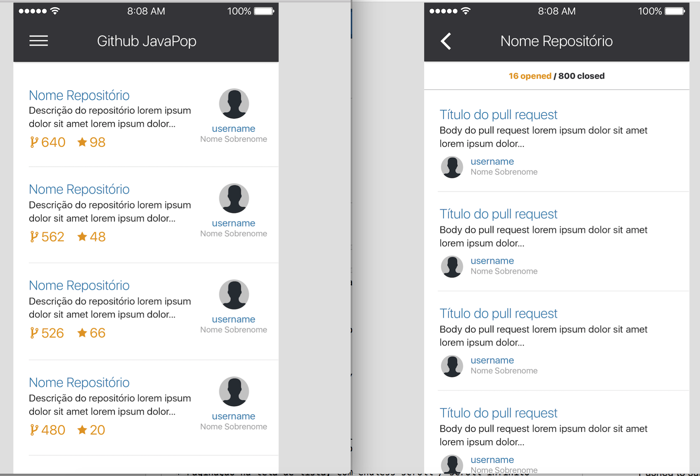

# Criar um aplicativo de consulta a API do [GitHub](https://github.com)#

Criar um aplicativo para consultar a [API do GitHub](https://developer.github.com/v4/) e trazer os repositórios mais populares de Swift. Basear-se no mockup fornecido:

### **Deve conter** ###

- __Lista de repositórios__. Exemplo de chamada na API: `https://api.github.com/search/repositories?q=language:Swift&sort=stars&page=1`
  * Paginação na tela de lista, com endless scroll / scroll infinito (incrementando o parâmetro `page`).
  * Cada repositório deve exibir Nome do repositório, Descrição do Repositório, Nome / Foto do autor, Número de Stars, Número de Forks
  * Ao tocar em um item, deve levar a lista de Pull Requests do repositório
- __Pull Requests de um repositório__. Exemplo de chamada na API: `https://api.github.com/repos/<criador>/<repositório>/pulls`
  * Cada item da lista deve exibir Nome / Foto do autor do PR, Título do PR, Data do PR e Body do PR
  * Ao tocar em um item, deve abrir no browser a página do Pull Request em questão

### **A solução DEVE conter** ##

* Versão mínima do iOS : 10.*
* Arquivo .gitignore
* Layout ajustável para diferentes telas de iPhone em portrait
* Gestão de dependências no projeto
* Framework para Comunicação com API
* Mapeamento json -> Objeto
* Integração com [Crashlytics](`http://fabric.io`)

### **Ganha + pontos** ###

* Histórico dos commits. Quanto mais commits e bem descritos, melhor para entendermos seu fluxo
* Células dimensionadas automaticamente, de acordo com o campo descrição do repositório na tela de lista e de acordo com o body do PR na tela de Pull Request
* Integração com [Fastlane](`http://docs.fastlane.tools`)
* Testes unitários no projeto
* Testes funcionais
* Cache de Imagens

### **Processo de submissão** ###

O candidato deverá implementar a solução e enviar um pull request para este repositório com a solução.

O processo de Pull Request funciona da seguinte maneira:

1. Candidato fará um fork desse repositório __(não irá clonar direto!)__
2. Fará seu projeto nesse fork
3. Commitará e subirá as alterações para o __SEU__ fork
4. Enviar um pull request pela interface do Github
